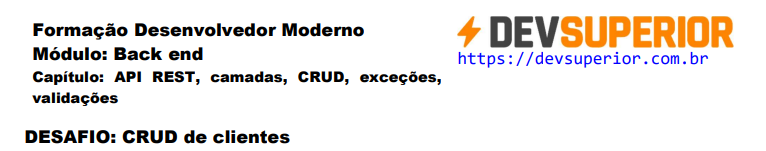
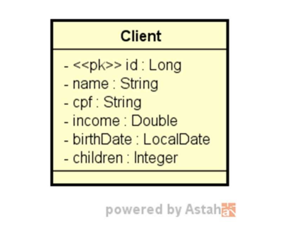
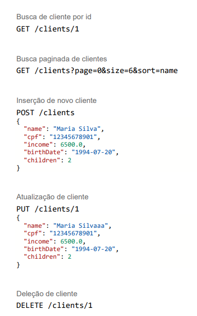

 <br><br>

## CRUD de Clientes - Spring Boot



Este projeto implementa um CRUD completo de clientes usando Spring Boot 3.3.4 e Java 21, com um web service REST para gerenciar clientes. Ele inclui as cinco operações básicas de um CRUD: busca paginada, busca por ID, inserção, atualização e deleção de clientes. O projeto usa o banco de dados PostgreSQL para armazenamento de dados e Maven como gerenciador de dependências.

## Tecnologias Utilizadas

<br>
<div align="center">
  
  
  
  
  
  
  
   
</div>
<br>

- **Spring Boot 3.3.4:**  Framework para desenvolvimento de aplicações Java.
- **Maven:**  Gerenciamento de dependências e build.
- **PostgreSQL:**  Banco de dados relacional.
- **Hibernate:**  ORM para comunicação com o banco de dados.
- **Docker:** O Dockerfile foi configurado para rodar a aplicação com as seguintes etapas:
  - Usa a imagem base do OpenJDK.
  - Copia o código da aplicação.
  - Executa o comando para iniciar a API.

## Funcionalidades

- **Busca paginada de clientes:** Retorna uma lista paginada de clientes cadastrados.
- **Busca de cliente por ID:** Retorna um cliente específico pelo seu ID.
- **Inserir novo cliente:** Cadastra um novo cliente no sistema.
- **Atualizar cliente:** Atualiza os dados de um cliente existente.
- **Deletar cliente:** Remove um cliente do sistema.

## Regras de Validação

- **Nome:** Não pode ser vazio.
- **Data de nascimento:** Não pode ser uma data futura (validação via `@PastOrPresent`).
- **CPF, renda e quantidade de filhos:** Validações adicionais podem ser configuradas conforme a necessidade.

## Exceções Tratadas

- **ID não encontrado:** Retorna código HTTP 404 para requisições GET por ID, PUT e DELETE quando o ID não for encontrado.
- **Erro de validação:** Retorna código HTTP 422 com mensagens customizadas para cada campo inválido.

## Estrutura da Entidade Cliente Em UML



### Estrutura da Entidade Cliente
- **nome** (`String`): Nome do cliente (não pode ser vazio).
- **cpf** (`String`): CPF do cliente.
- **renda** (`Double`): Renda do cliente.
- **birthDate** (`LocalDate`): Data de nascimento do cliente (não pode ser uma data futura).
- **children** (`Integer`): Quantidade de filhos do cliente.

## Banco de Dados

O projeto está configurado para utilizar o banco de dados PostgreSQL. Certifique-se de que o PostgreSQL está instalado e configurado corretamente no seu ambiente.

## Configuração do PostgreSQL

No arquivo `application.properties` ou `application.yml`, configure suas credenciais do PostgreSQL:

```properties
spring.datasource.url=jdbc:postgresql://localhost:5432/nome_do_banco
spring.datasource.username=seu_usuario
spring.datasource.password=sua_senha
spring.jpa.hibernate.ddl-auto=update
spring.jpa.properties.hibernate.dialect=org.hibernate.dialect.PostgreSQLDialect
````
# Seed de Dados

Ao iniciar o projeto, um seed inicial de 10 clientes significativos será inserido automaticamente no banco de dados.

## Instalação e Execução

### Pré-requisitos

- Java 21
- Maven
- PostgreSQL

### Passos para executar o projeto:

1. Clone o repositório:

   ```bash
    git clone https://github.com/seu-usuario/nome-do-repositorio.git
   ````
2. Acesse o diretório do projeto:
   ```bash
   cd nome-do-repositorio
   ````
3. Configure o PostgreSQL no arquivo de propriedades conforme mostrado acima.
4. Execute o projeto usando Maven:
   ```bash
   mvn spring-boot:run
   ````
   - A aplicação estará disponível em http://localhost:8080.

## Deploy da API
1. A API foi implantada no serviço Render e está disponível no seguinte link: 
  - https://desafio-crud-rest-api-render.onrender.com/

## Como acessar a API
2. Você pode acessar a API REST em produção através do link acima. Abaixo estão alguns exemplos de endpoints disponíveis:
     
## Endpoints

- GET **/clients**: Busca paginada de clientes.
- GET **/clients/{id}**: Busca um cliente por ID.
- POST **/clients**: Insere um novo cliente.
- PUT **/clients/{id}**: Atualiza um cliente existente.
- DELETE **/clients/{id}**: Deleta um cliente.

## Deploy no Render
1. **O deploy foi feito na plataforma Render. Seguem os passos principais que foram utilizados para fazer o deploy da aplicação:**

- Criar um repositório no GitHub ou GitLab: O código da API foi versionado no GitHub.
- Conectar o repositório ao Render: No painel do Render, conectei o repositório ao serviço para que ele pudesse ser automaticamente atualizado a cada novo push.
- Configurar o Docker: A aplicação foi configurada para ser executada em um container Docker, usando o Dockerfile presente no projeto.
- Deploy automático: Sempre que há uma atualização no repositório, o Render faz o build e deploy automaticamente.

## Autor
**Desenvolvido por Gabriel Lucas Rodrigues Souza** como parte do curso Formação Desenvolvedor Moderno da DevSuperior.

